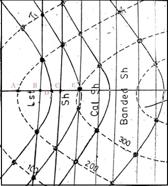

## Post test
Q 1. An isocline is a line joining points with equal __________ 
<b>a. Slope</B> 
b. Distance 
c. Spatial Distance 
d. None of the Above  

Q 2. An isopycnal is a line of constant __________ 
a. Wind Speed 
b. Pressure 
<b>c. Density</b> 
d. None of the Above  

Q 3. Contour map is given below based on it answer the following questions with best possible answer 
 
Scale: 1cm=100m 
Given That: AD=1.80cm, AB=1.15m, BD=0.6cm, DC=0.5cm, CE=1m 
What is the angle of dip (in degree) of Shale bed? 
<b>a. 45</b> 
b. 54 
c. 60 
d. 30  

Q 4. Which of the following is true regarding the shape of contour lines 
a. They are rectangular in shape 
b. They are circular in shape 
<b>c. They don’t have a definite shape</b> 
d. None of the above  

Q 5. Closed contours indicate a ____________ or a ________________ 
<b>a. Hilltop; depression</b> 
b. Hilltop; valley 
c. Hilltop; flat slope 
d. All of the above  
