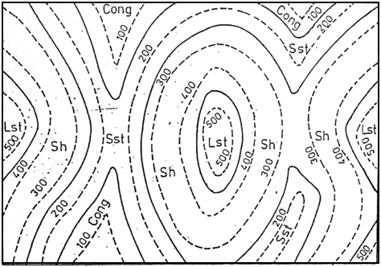

## <b> Pre-test </b>
#### Please attempt the following questions

Q 1. In a single contour line, at any point the elevation is ____________________ 
a. Constantly Increases 
b. Constantly Decreases 
<b>c. Same</b> 
d. None of the above  

Q 2. Which of the following is false? 
a. No two lines meet on intersect each other in any case 
b. If the contour lines are at very large distance to each other, this indicates a gentle slope 
c. If the closed lines have higher elevation in the center then it represents the hill or mountain 
<b>d. None of the above</b>  

Q 3. Which of the following statement is/are true regarding the following contour map 
   
a. Each of the rock beds are inclined with horizontal at angle of 32.15&deg; 
<b>b. Each of the rock beds are parallel to horizontal surface i.e Angle of Dip =0&deg;</B> 
c. Thickness of Shale bed rock is less than 100 m at each and every point of the contour map 
d. None of the above  

Q 4. What is the possible index of the point “X” shown in the contour map below? 
a. 1150 
<b>b. 1250</b> 
c. 1350 
d. 1450  

Q 5. An isogon is a contour line for a variable which measures ___________ 
a. Distance 
b. Elevation 
<b>c. Direction</b> 
d. None of the Above  
